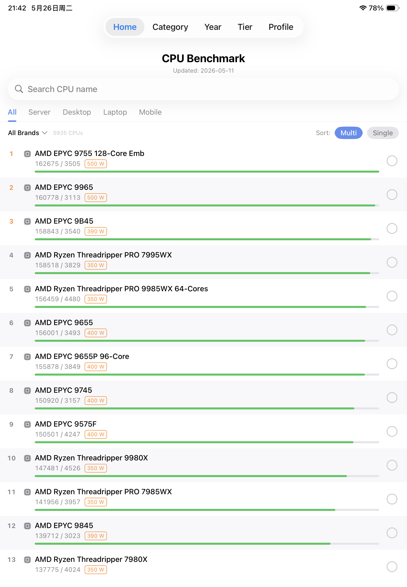

CPU Rank is a native iOS application for iPhone and iPad that provides comprehensive CPU performance rankings and comparisons. Unlike scattered online benchmarks, this app features a clean, modern interface with fluid native animations and dark mode support — redefining how CPU performance data is accessed and compared.

The app covers 5900+ CPUs with detailed specifications including multi-core score, single-core score, core count, frequency, TDP, socket type, and release date. It also supports multi-dimensional filtering, performance tier charts, and side-by-side comparisons — the perfect tool for PC builders, tech enthusiasts, and hardware researchers.

✨ Highlight: Tap any CPU to enter an immersive detail view. Compare up to 5 CPUs side-by-side with interactive charts. Multi-language support available for users worldwide (English, Chinese, Japanese, Korean, German, French, Spanish, Portuguese, Russian).

## ✨ Features

### 🎨 Modern User Experience
- **Clean Interface**: Minimalist design with system-native UI components and smooth animations.
- **Dark Mode Support**: Seamlessly adapts to system appearance with optimized color schemes.
- **Universal Device Support**: From iPad Pro to iPhone SE, elegant adaptive layouts with free portrait/landscape switching.
- **Multi-language Support**: Switch interface language with one tap (10 languages supported).

### 📊 Comprehensive Data & Filtering
- **Performance Rankings**: Browse 5900+ CPUs sorted by multi-core or single-core performance.
- **Smart Search**: Quickly locate CPUs by model name with instant results.
- **Category Filter**: Filter by Desktop, Laptop, Server, or Mobile/Embedded processors.
- **Brand Filter**: Focus on specific brands (Intel, AMD, Apple, ARM, and more).
- **Socket Type Groups**: Browse CPUs by socket compatibility (LGA1700, AM5, etc.).
- **Release Year Filter**: Find CPUs by release quarter and year.

### 🔬 Performance Tier Chart
- **Visual Ranking**: Color-coded performance tiers (Flagship, High-End, Mid-Range, Entry-Level).
- **Timeline View**: See how CPU performance evolved over recent years.
- **Score Distribution**: Understand where each CPU stands in the performance spectrum.

### 🆚 Advanced Comparison
- **Multi-CPU Comparison**: Compare up to 5 CPUs side-by-side with detailed specs.
- **Interactive Charts**: Visual comparison of multi-core and single-core scores.
- **Parameter Table**: Side-by-side comparison of all technical specifications.
- **Comparison History**: Revisit your previous comparisons with one tap.

### 📱 User-Friendly Features
- **Favorites**: Bookmark CPUs you're interested in for quick access.
- **Browse History**: Automatically tracks recently viewed CPUs.
- **Similar CPUs**: Discover CPUs with similar performance levels.
- **Offline Mode**: All data stored locally — works without internet connection.

## 🎯 Who Is It For?

**PC Builders**: Planning your next build? Compare CPUs by performance, socket type, and release date. Find the perfect processor for your budget and use case — gaming, productivity, or content creation.

**Tech Enthusiasts**: Stay up-to-date with the latest CPU releases. Compare flagship processors from Intel, AMD, and Apple. Understand performance trends and make informed upgrade decisions.

**Hardware Researchers**: Look up detailed CPU specifications on the go. Access comprehensive data including cache sizes, memory support, and TDP ratings — perfect for technical analysis.

**Laptop Shoppers**: Compare mobile processors to find the best laptop for your needs. Filter by performance tier and see which CPUs offer the best balance of power and efficiency.

**IT Professionals**: Quickly reference server CPU specifications for infrastructure planning. Compare multi-core performance for virtualization and compute workloads.

## 📧 Support or Contact

**Email**: supportsw365@163.com

Have questions, suggestions, or found a bug? We'd love to hear from you!

---

*Data updated: 2026-05-11*  
*Total CPUs: 5935*
